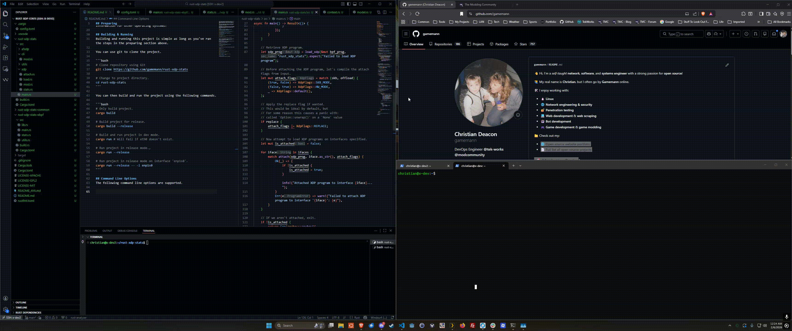

A small project that utilizes an awesome Rust library called [Aya](https://aya-rs.dev/book/). The goal of this project is to replicate functionality from my [XDP Stats](https://github.com/gamemann/XDP-Stats) project I made years ago in C using Rust and Aya. The XDP/eBPF kernel program is written in Rust as well!



The XDP program simply increments counters for total packets and bytes using a per CPU array map and displays the total counters inside of the user-space program.

At this time, this project does not include all features from my original XDP Stats program in C. The following features are missing, but will be added in the future!

* AF_XDP socket support
* Redirect/XDP_TX support (with FIB lookup)
* Printing total counters at the end execution.
* Program duration support.

## Preparing
I developed this project using Debian 13 and the following commands should prepare your environment to run this project. I'd recommend giving [this](https://aya-rs.dev/book/start/development.html) documentation a read as well!

```bash
# Install required packages through apt.
sudo apt install -y git curl cmake pkg-config libssl-dev llvm-19-dev libclang-19-dev libpolly-19-dev

# Install Rust using rustup.
curl --proto '=https' --tlsv1.2 -sSf https://sh.rustup.rs | sh

# We need the Rust stable and nightly toolchains.
rustup install stable
rustup toolchain install nightly --component rust-src

# Install linker.
cargo install bpf-linker

# This is optional, but will be needed if you want to generate your own Aya project:
# cargo install cargo-generate

# cargo generate https://github.com/aya-rs/aya-template
```

**NOTE** - The default README that comes with Aya projects may be found [here](./README_AYA.md). This README contains more information for other operating systems!

## Building & Running
Building and running this project is simple as long as you've ran the steps in the preparing section above.

You can use git to clone the project.

```bash
# Clone repository using Git
git clone https://github.com/gamemann/rust-xdp-stats

# Change to project directory.
cd rust-xdp-stats
```

You can then build and run the project using the following commands.

```bash
# Only build project.
cargo build

# Build project for release.
cargo build --release

# Build and run project in dev mode.
cargo run # Will fail if eth0 doesn't exist.

# Run project in release mode.,
cargo run --release

# Run project in release mode on interface 'enp1s0'.
cargo run --release -- -i enp1s0
```

## Command Line Options
The following command line options are supported.

| Args | Default | Description |
| ---- | ------- | ----------- |
| `-i --iface` | `eth0` | The interface(s) to attach the XDP program to. You may separate interfaces with commas (e.g. `eth0,eth1`). |
| `-d --duration` | `0` | How long to run the program for in seconds (0 = unlimited util CTRL + C). |
| `-a --afxdp` | - | If set, redirects packets to AF_XDP sockets and calculates counters there instead. |
| `-n --num-socks` | `0` | The amount of AF_XDP sockets to create if using AF_XDP mode (0 = Auto). |
| `-s --skb` | - | If set, attempts to load the XDP program in SKB mode which is slower, but more compatible. |
| `-o --offload` | - | If set, attempts to offload the XDP program to the NIC hardware (only certain NICs support this). |
| `-z --replace` | - | If set, passes the `REPLACE` flag when attaching the XDP program which replaces the XDP program if it is already loaded. For some reason this results in a crash. Otherwise it would be set by default. |

## Credits
* [Christian Deacon](https://github.com/gamemann)